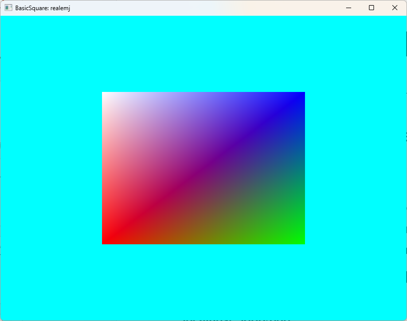
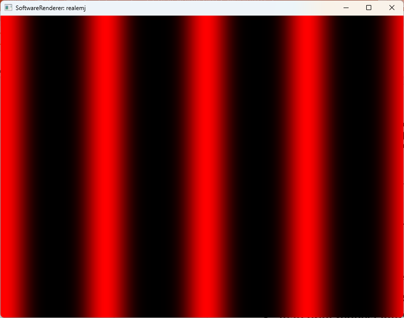

# CS 450/535: Computer Graphics
***Fall 2026***  
***Author: YOUR NAME HERE***  
***Original Author: Dr. Michael J. Reale***  
***SUNY Polytechnic Institute*** 

## Software Dependencies
You will need to install the following manually:
- C++ compilers
- CMake
- Visual Code
- Vulkan SDK

The rest of the dependencies will be automatically fetched by CMake.

## Applications

### BasicSquare

This application should show a multi-color quad on the screen with a cyan background.



### SoftwareRenderer

This application shows a repeating red pattern that follows the mouse X movement.  The sine wave period is hardcoded to 200, and the ```hostFramebuffer``` is appropriately resized when the window resizes.



